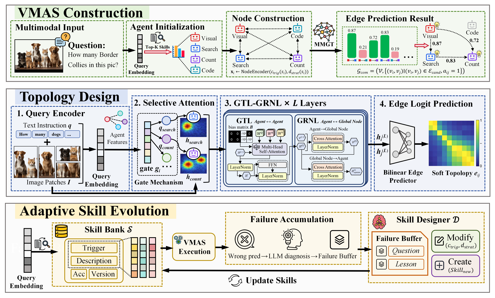

# SkillGraph

## Overview
**SkillGraph: Self-Evolving Multi-Agent Collaboration with Multimodal Graph Topology** [[arXiv Paper]](https://arxiv.org/abs/2604.17503)

 


The algorithm implementation code is in `SkillGraph` folder, and the experimental code is in `experiments` folder.

## Quick Start

### Install packages

```bash
conda create -n skillgraph python=3.10
conda activate skillgraph
pip install -r requirements.txt

# Start vLLM server
python -m vllm.entrypoints.openai.api_server \
  --model /path/to/your/model \
  --host 0.0.0.0 --port 8000 --dtype auto --gpu-memory-utilization \
  --max-model-len \
  --enable-auto-tool-choice \
  --tool-call-parser hermes
```

### Add API keys in `template.env` and change its name to `.env`

```bash
BASE_URL = "" # the BASE_URL of OpenAI LLM backend
API_KEY = "" # for OpenAI LLM backend
```
### Run SkillGraph 
Taking mmbench as an example:
```bash
python experiments/run_mmbench.py \
  --mode <mode> \
  --batch_size <batch_size> \
  --agent_nums <agent_nums> \
  --num_iterations <num_iterations> \
  --optimized_spatial \
  --evolve_skills
```

**Parameter descriptions:**

| Parameter | Description |
|---|---|
| `--mode` | Graph topology. |
| `--batch_size` | Number of samples per training batch. |
| `--agent_nums` | Number of agents in the graph. |
| `--num_iterations` | Number of optimization iterations during training. |
| `--optimized_spatial` | Flag. Enable spatial topology learning via MMGT. |
| `--evolve_skills` | Flag. Enable skill evolution via SkillDesigner. Can be used independently of topology optimization. |


### Add a New Dataset
If you want to add a new dataset:
- Place the dataset loading script in: `/path/to/skillgraph/skillgraph_datasets`
- Place the running script in: `/path/to/skillgraph/experiments`

## Acknowledgement

This code refers to [GPTSwarm](https://github.com/metauto-ai/GPTSwarm).